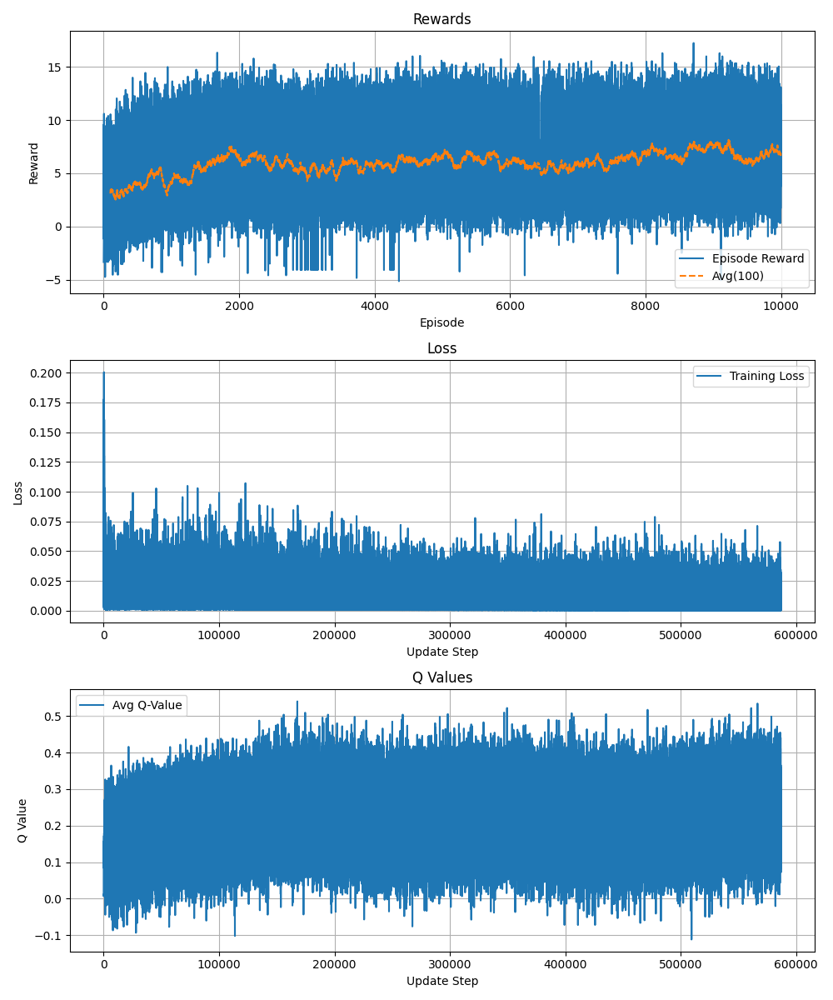

# Github Community's Reversi

## What's Reversi
Reversi is a turn-based strategy board game for two players: Black (Solid) and White (Hollow). The game is played on an 8x8 board.
- Players take turns placing a disc of their color on the board.
- A valid move must capture one or more of the opponent's discs by "sandwiching" them in a straight line (horizontal, vertical, or diagonal).
- All sandwiched discs are flipped to the current player's color.
- If a player has no valid move, they pass the turn.
- The game ends when neither player can move. The player with more discs wins.

## How to play
- Click a hint dot to open an issue.
- Simply click "Create" to play that move.
- Github Actions workflow will update my profile README.md.
- You'll see the board updated shortly.

## Current state
This is the **Community Version**  
Click a move to join the human-only game.  
Want to challenge AI instead? [Switch to AI version](https://github.com/Peng-Jen/Peng-Jen/tree/AI)

Now, it's your turn!
**HOLLOW** to move.

|   | A | B | C | D | E | F | G | H |
|---|---|---|---|---|---|---|---|---|
| **1** |  |  |  |  |  |  |  |  |
| **2** |  |  |  |  |  |  |  |  |
| **3** |  |  |  |  |  |  |  |  |
| **4** |  |  |  |  |  |  |  |  |
| **5** |  |  |  |  |  |  |  |  |
| **6** |  |  |  |  |  |  |  |  |
| **7** |  |  |  |  |  |  |  |  |
| **8** |  |  |  |  |  |  |  |  |

### Best Single Moves
| Rank | User | Flipped |
|------|------|---------|
| 🥇 | [@winniehuang0616](https://github.com/winniehuang0616) | 3 |
| 🥈 | [@winniehuang0616](https://github.com/winniehuang0616) | 3 |
| 🥉 | [@winniehuang0616](https://github.com/winniehuang0616) | 3 |
| 4 | [@winniehuang0616](https://github.com/winniehuang0616) | 3 |
| 5 | [@Peng-Jen](https://github.com/Peng-Jen) | 2 |

### Top Contributors
| Rank | User | Moves |
|------|------|--------|
| 🥇 | [@winniehuang0616](https://github.com/winniehuang0616) | 7 |
| 🥈 | [@Peng-Jen](https://github.com/Peng-Jen) | 2 |

# About Agent

The default AI agent is a Deep Q-Network trained on the 8x8 Reversi board.  
It uses a convolutional neural network to estimate Q-values for each of the 64 board positions and selects actions using an epsilon-greedy policy.

## Training Configuration:
- **Network**: Simple CNN with linear head
- **Input**: 8x8x3 board state tensor
- **Output**: Q-values for all 64 positions
- **Loss Function**: SmoothL1Loss (Huber)
- **Optimizer**: Adam, learning rate = 1e-5
- **Discount Factor ($\gamma$)**: 0.99
- **Exploration**: Epsilon-greedy  
- **Replay Buffer Size**: 100,000
- **Batch Size**: 128
- **Target Network Update**: Soft update with $	au$ = 0.01

## Training Progress:

The following plot shows the agent's performance over 10,000 episodes:
- **Top**: Episode reward (with rolling average)
- **Middle**: Loss during updates
- **Bottom**: Average Q-value across actions

  

## Disclaimer

This project is my personal exploration into reinforcement learning and game AI.  
I'm still quite new to the field of RL, so the current agent, reward design, and training pipeline might not reflect best practices.

If you have any feedback, suggestions, or ideas for improvement — whether it's about the model architecture, training strategies, or gameplay logic — I'd love to hear from you!

Feel free to open an issue, submit a pull request, or just reach out.  
Any guidance from experienced practitioners is genuinely appreciated!
# About me
## Tim Chen #Peng-Jen
- Studying in Communication Engineering @ National Taiwan University
- International Exchange Student @ Keio University, Japan
- B.S. in Mathematics & B.B.A. in Information Management @ National Taiwan University

## Interested Area
- Operations Research, Optimization
- Decision Analysis
- Data Science
- Reinforcement Learning

## Skill Set
- Operations Research
- Machine Learning
- Applied Mathematics

## Learning Topics
- Game Theory
- Discrete Optimization Algorithm

## Connect with me
- [LinkedIn](https://www.linkedin.com/in/tim-chen-1a92a825a/)
- tim.pjchen@gmail.com
